# Introduction
This is a project to demonstrate all the physical IO on the SI Labs BRD4001A Wireless starter kit with the BRD4300A Bluetooth module radio board and BRD8006A add-on board available together as SLWSTK6101C.

Each of the four buttons on the starter kit main board and add-on board is on the same GPIO pin as an LED. The GPIO can't be used as an input or output simultaneously. Therefore, in this demo the buttons operate in pairs to demonstrate input and output functionality – the two buttons on the main board and the two on the add-on board. Pressing a button will toggle the functionality of its pair between input and output. So pressing button PB0 will make LED1 turn on, and PB1 will no longer be an input so the button will not work. Pressing PB0 again will turn the LED off and make PB1 an input again.

The display will show the direction the joystick is being pressed along with the state of the GPIO pins.

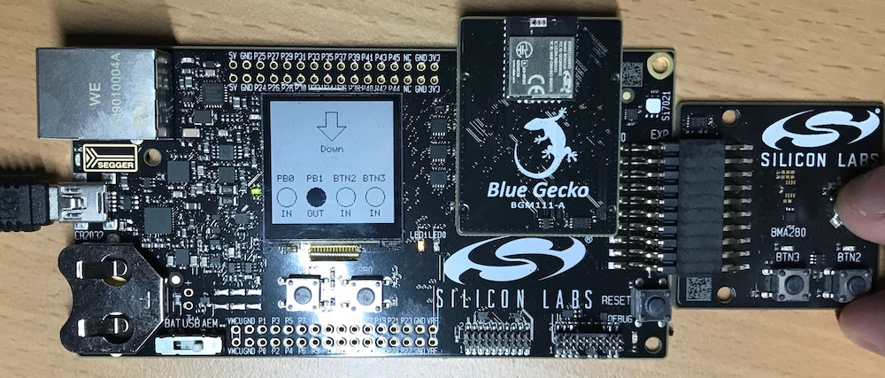

# Why have you done this?

I have used BlueGiga modules for product development for some years, and since BlueGiga was aquired by SI Labs and released new modules, I wanted to learn how to use them. The best way to learn is to teach! The examples for the modules are limited and the documentation is slim in some places, conflicting in others, and in various locations. It took quite some trial and error and a lot of reading to assemble this project.

If you are looking for Bluetooth firmware and/or iOS App development, please [get in touch](https://nickbrook.me/contact)!

# Relevant documentation

[UG122: BGM111 Bluetooth Module Radio Board User's Guide](https://www.silabs.com/documents/login/user-guides/ug122-brd4300a-user-guide.pdf)

[UG136: Silicon Labs Bluetooth C Application Developer's Guide](https://www.silabs.com/documents/login/user-guides/ug136-ble-c-soc-dev-guide.pdf)

[Bluetooth Smart Software API Reference Manual](https://www.silabs.com/documents/login/reference-manuals/BluetoothSmart_APIRefMan.pdf)

[BGM111 Blue Gecko Bluetooth ® Module Data Sheet](https://www.google.co.uk/url?sa=t&rct=j&q=&esrc=s&source=web&cd=1&cad=rja&uact=8&ved=0ahUKEwi63_uCq9LWAhUBuRoKHbFVC8MQFggoMAA&url=https%3A%2F%2Fwww.silabs.com%2Fdocuments%2Flogin%2Fdata-sheets%2FBGM111_datasheet.pdf&usg=AOvVaw2Coo-7_W-M0IsIK7pYD_8Y)

[BRD4300A Reference Manual](https://www.silabs.com/documents/login/reference-manuals/BRD4300A-RM.pdf)

[EFR32 Blue Gecko 1 Software Documentation](http://devtools.silabs.com/dl/documentation/doxygen/5.2.0/efr32bg1/html/index.html)

[EFR32xG1 Wireless Gecko Reference Manua](https://www.silabs.com/documents/public/reference-manuals/EFR32xG1-ReferenceManual.pdf)

[AN0012: General Purpose Input Output](https://www.silabs.com/documents/public/application-notes/an0012-efm32-gpio.pdf)

[Technical Resource Search](https://www.silabs.com/support/resources.p-wireless_bluetooth-low-energy_blue-gecko-bluetooth-low-energy-modules.p-wireless_bluetooth-low-energy_blue-gecko-bluetooth-low-energy-socs)

# Instructions to recreate

## Create the project

1. Select the BGM module on the left of the launcher and select new project

	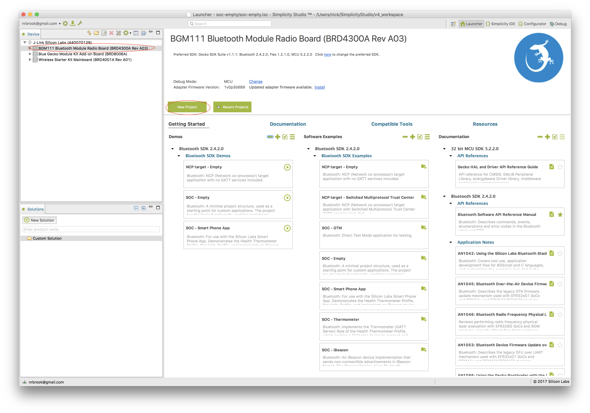
1. Select Bluetooth SDK

	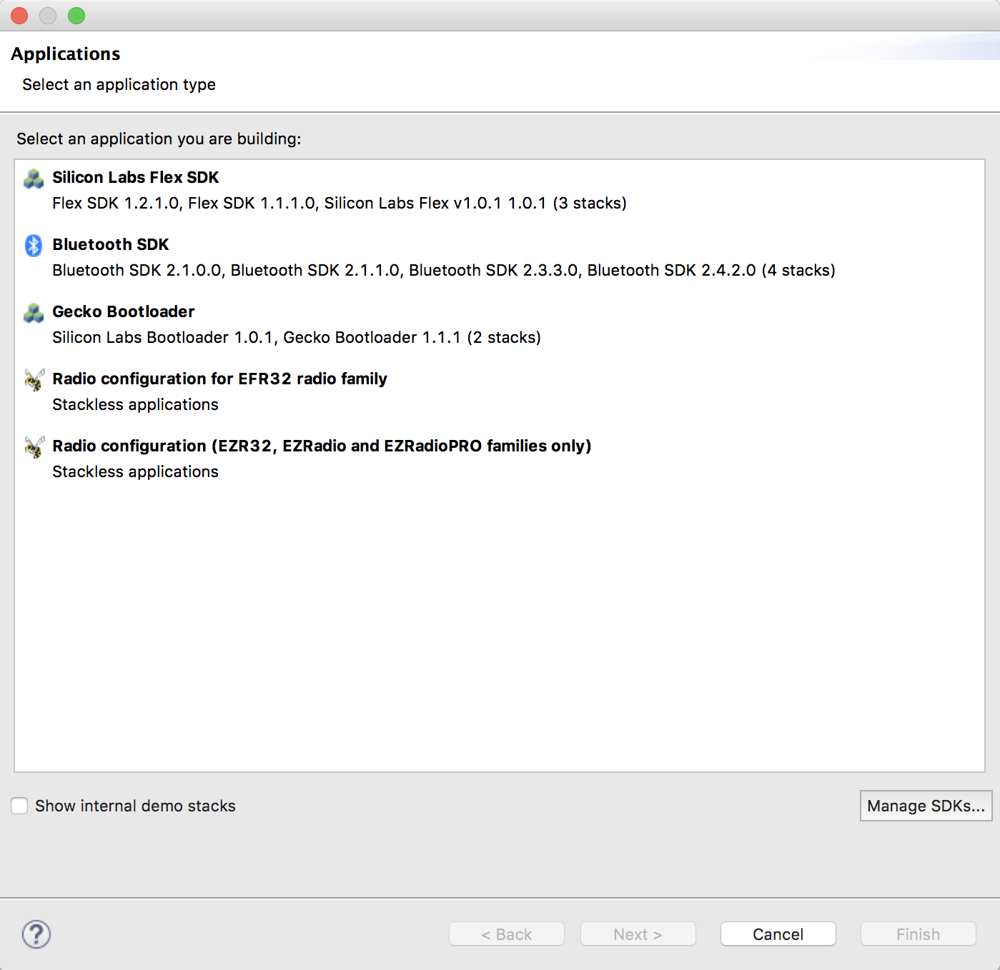
1. Select the latest Bluetooth SDK version

	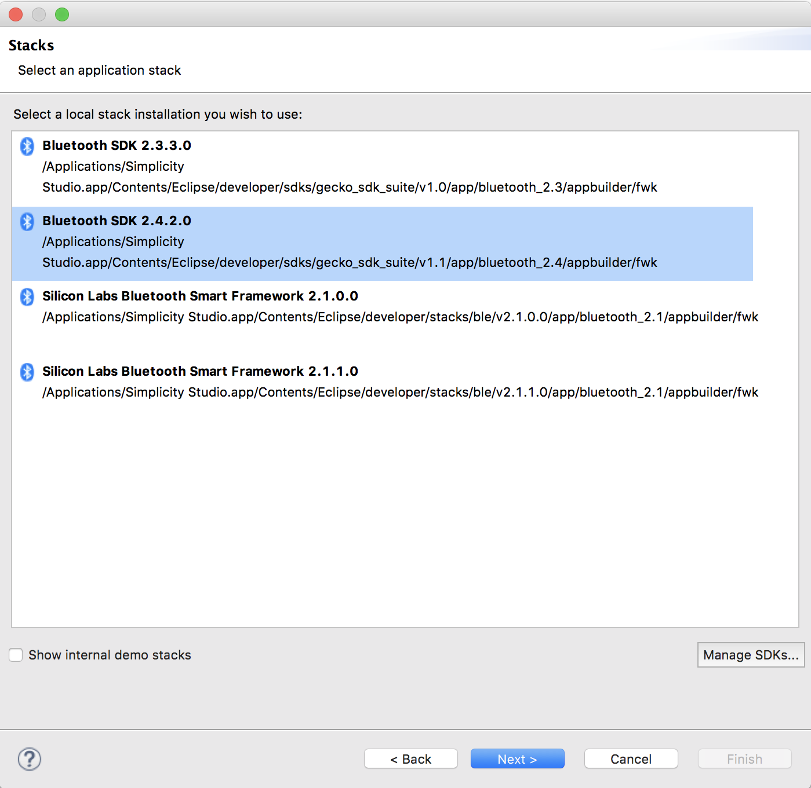
1. Select 'SOC - Empty' project

	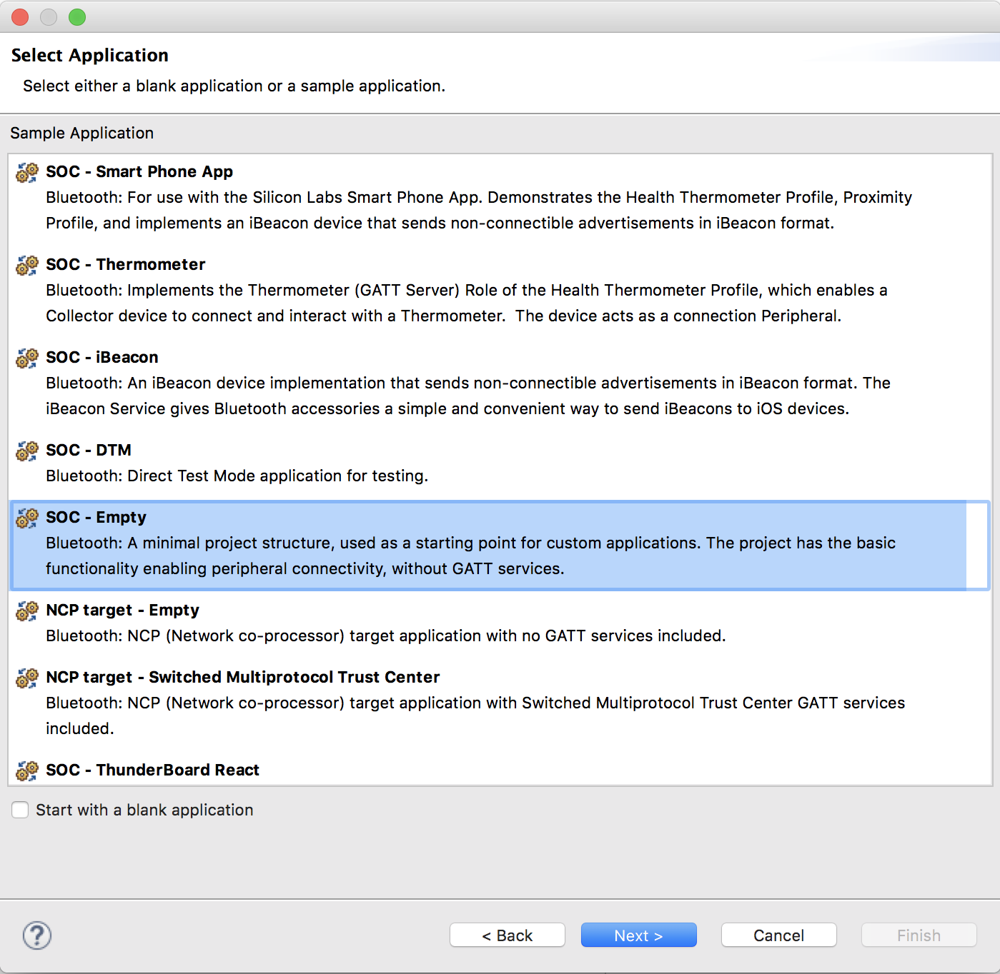
1. Give the project a name

	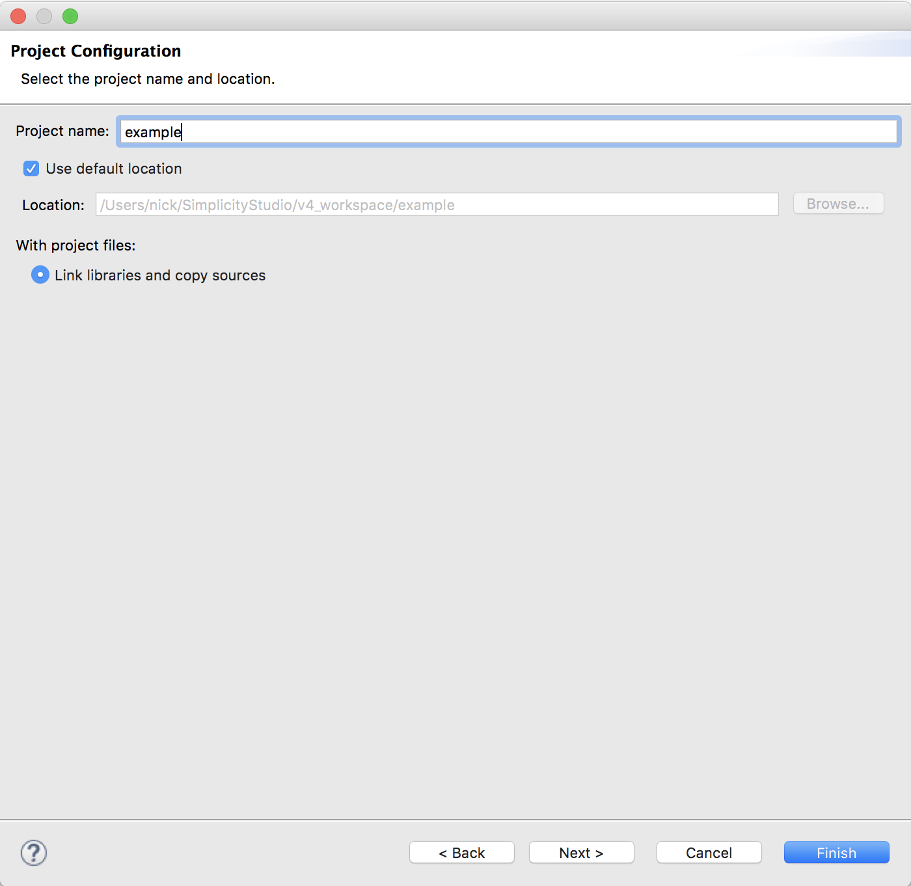
1. Uncheck older compiler versions and click finish. You have now created a blank template project.
	
	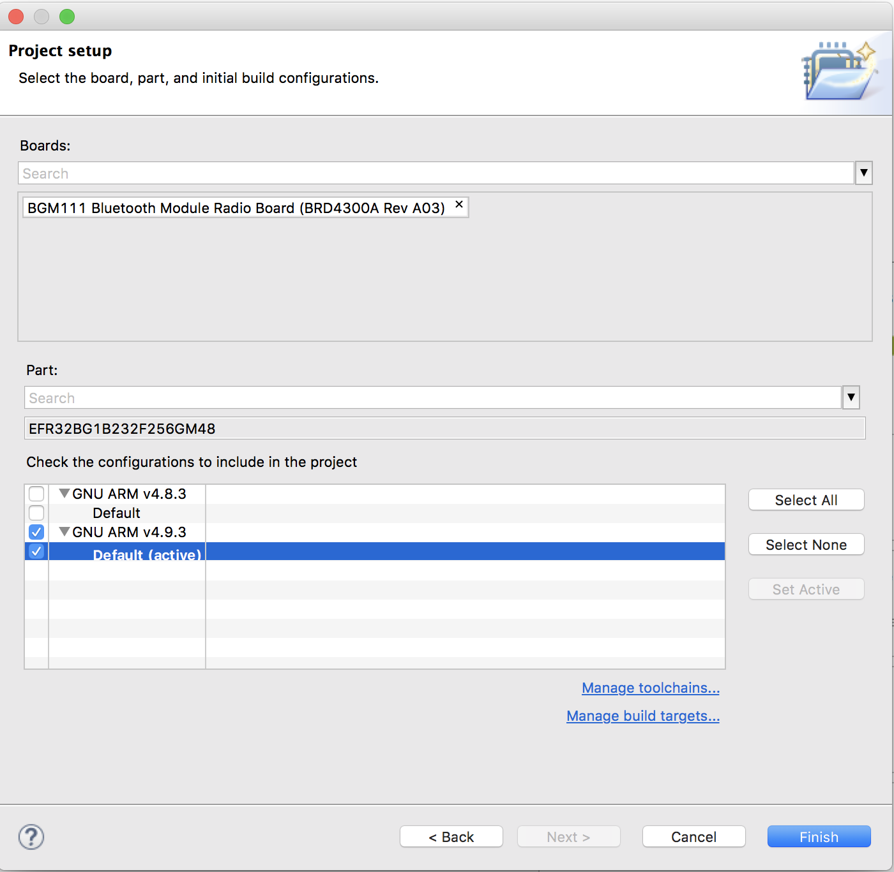

## Configure hardware

We will configure all hardware now even though the rest of the steps will be divided into functionality.

1. Open the .hwconf file in your project, and make sure the 'Configurator' perspective is selected in the top toolbar. At the bottom click DefaultMode Peripherals. Check ADC0 (for the joystick), I2C0 (for the display), and uncheck PRS. Select ADC0, and in the properties view select the 'Single Sample mode' tab. Change the properties shown in blue: Single sample mode: Enabled, Reference: Buffered VDD, Input: APORT3XCH8 (PA0).

	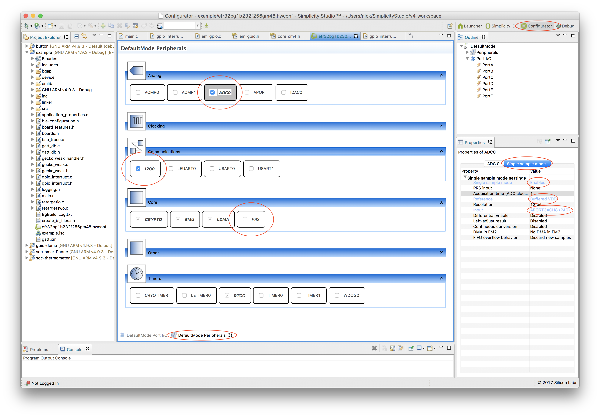
1. Select Port I/O in the outline view. In the properties view, scroll down to I2C0, and set the location of both SCL and SDA to 15 and enable both

	
1. Go back to Default Port I/O. You should now see some pins have their new functionality attached. Select PF6 and set the pin mode to Input, Filter to Enabled, and the custom pin name BUTTON_LED0. Do the same for PF7, PF4, and PA1 as shown.

	
1. Select the I2C0_SCL and I2C0_SDA pins and set the pin mode to Wired and pull-up filter.

	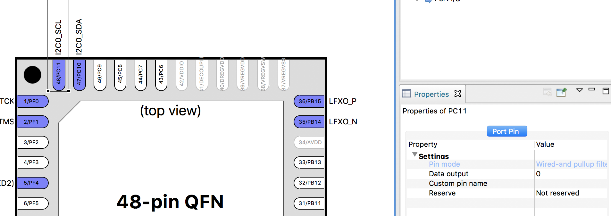
1. Save the file to generate src/InitDevice.c in your project, which initialises the hardware to the configuration you specified.

## Add debugging output

The STK can be configured to send debug output over SWO or UART. In the STK, the UART TX pin is used by the Joystick input from the extension board, so we can't use UART in this example. SWO does not work nicely right now due to bugs in Simplicity Studio, but we'll use it anyway. UART is recommended for other use cases.

1. Expand bgapi in your project, right click a file and click 'Browse files here'. This will take you into the SDK, a few levels deep. Go up the directories until you get to `gecko_sdk_suite/v1.1/`. This is the SDK root. Expand `hardware/kit/common/bsp`. Drag `bsp_trace.c` into your project, and in the popup dialog select 'Link to files' and in the "Relative to" drop down select `STUDIO_SDK_LOC`

	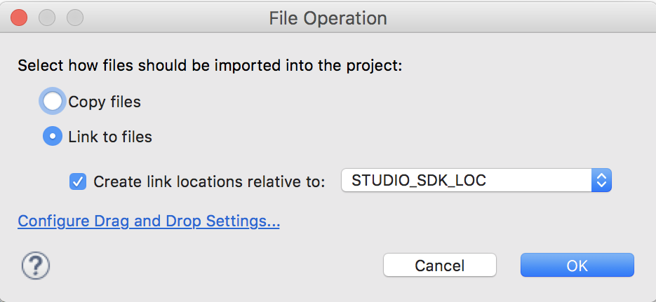
1. Go up a level to `common` and in to `drivers`. Select `retargetio.c`, `retargetswo.c` (if using UART here you would select `retargetserial.c` instead of `retargetswo.c`). Drag the two selected files into your project and link as in the previous step.
1. From this project, drag in `logging.h`. You probably want to copy this file into your project. It's worth looking at logging.h to see what it does, and note the options at the top. You will see it depends on a `LOG_LEVEL` definition, we will add this now to the project.
1. Right click the project and click 'Properties'. Expand `C/C++ General > Paths and Symbols`. Next to 'Configuration', click 'Manage Configurations'. Duplicate the default configuration. Rename the default configuration to 'Debug' and the copy to 'Production'. Be sure to click off the text field after renaming as just clicking OK will not save the change. Make sure the Debug configuration is active.

	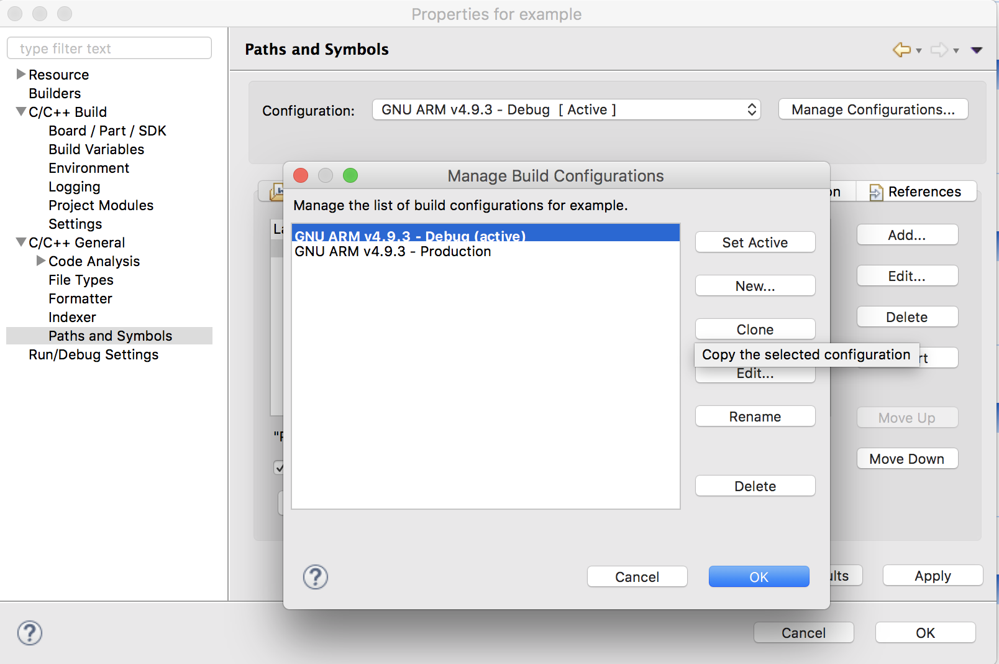
1. After creating the new configuration, back in the `Paths and Symbols` section, select the 'Symbols' tab and click 'Add'. Set the Name as `LOG_LEVEL` and the value as `3`. Check 'Add to all languages'. Click OK.
1. Expand `C/C++ Build > Settings`. In 'Debug Settings' change 'Debug Level' to -g3. From GNU GCC documentation, "Level 3 includes extra information, such as all the macro definitions present in the program. Some debuggers support macro expansion when you use -g3."
1. In `GNU ARM C Compiler > Optimization` change the "Optimization level" to "None (-O0)". With optimization disabled, when debugging the debugger will step through code correctly. Click OK to close Properties.
1. In `main.c`, underneath the existing includes add

	```
	#include "retargetswo.h"
	#include "logging.h"
	```
1. Change the `void main(void)` function definition to `int main(void)` to avoid a compiler warning.
1. In `int main(void)`, after `enter_DefaultMode_from_RESET();`, add `RETARGET_SwoInit();` to initialise SWO.
1. Add a test logging statement underneath, `LogInfo("Hello World");`
1. In the toolbar, next to the debug icon, click the down arrow, and select "Debug Configurations"

	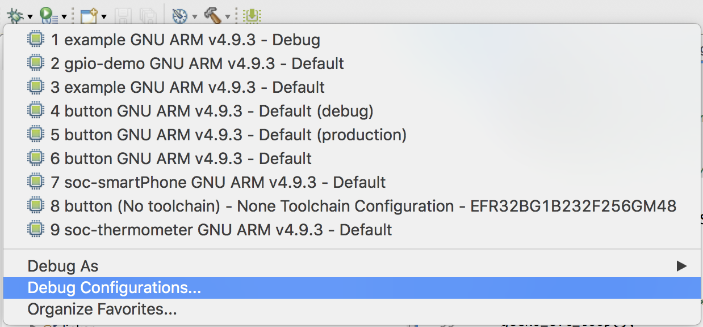
1. Ensure our project Debug configuration is selected on the left, and select the "Configuration" tab. Uncheck "Break at main". Click "Debug"

	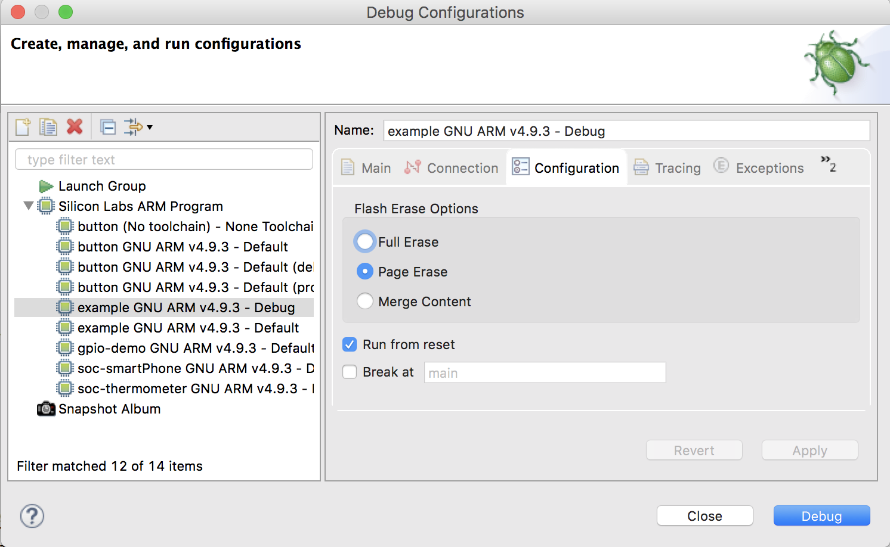
1. Simplicity will load the application to the module and connect the debugger. SWO output should appear in the Program Output Console at the bottom, but this is broken. To get the SWO output, click the red disconnect icon.

	
1. Open a terminal/command prompt/power shell window. Navigate to the commander binary location (Windows: `C:\SiliconLabs\SimplicityStudio\v4\developer\adapter_packs\commander\commander.exe`, Mac: `/Applications/Simplicity\ Studio.app/Contents/Eclipse/developer/adapter_packs/commander/Commander.app/Contents/MacOS/commander`). Run `commander swo read -s <serial>` where `<serial>` is obtained from the launcher screen in Simplicity, e.g. "440070111"
1. Press the RESET button on the STK. You should see the log output in the terminal.

## Simplify gecko events

Having a big switch statement in main for all system events is not conducive to creating clean, well structured code. I build an event loop handler to call weakly defined functions that you can provide the implentation for anywhere in your project.

1. From this project, drag in `gecko_weak_handler.h`, `gecko_weak.h` and `gecko_weak.c`. `gecko_weak_handler.h` contains the function prototypes for the main event loop. `gecko_weak.h` contains the weak function prototypes for the event handlers. You do not need to include this in your .c files when implementing an event handler.
1. In `main.c`, add 

	```
	#include "gecko_weak_handler.h"
	```

	then replace the entire while loop in `main()` with 
	```
	/* Enter main event loop */
		gecko_evt_loop();
	```
	You should add the code from the switch statement into the individual event functions `gecko_evt_system_boot()`, `gecko_evt_le_connection_closed()` and `gecko_evt_gatt_server_user_write_request()`. Copy from this project for convenience.


## Simplify interrupt configuration and handling

There are a few stumbling blocks for interrupt configuration using the built in SDK functions:

* When changing the configuration of an interrupt, an interrupt may be generated. If the interrupt enable was not off before changing the configuration, your code will receive the interrupt. Although this is documented in the comments for the interrupt configuration functions, it is non-obvious and not expected.

* There are 16 GPIO interrupts. Usually an interrupt for a pin number would be configured for the same interrupt number. If you want an interrupt on two pins with the same pin number on different ports, this conflicts. Usually it's up to the developer to manage this complexity.

* When enabling interrupts, if there was an interrupt generated while the interrupt was disabled (perhaps from changing pin configuration) it will be triggered when the interrupt is enabled. Again, while documented, this is behaviour which may surprise developers.

* Interrupt handling is through two functions which will perform essentially the same task, and dispatch to the gecko event loop. The interrupt number is specified, but this does not map cleanly back to a specific pin on a specific port.

I wrote a replacement library which wraps the built in functions and handles this complexity internally. Interrupts will not be generated when changing configuration or enabling interrupts, and pins will automatically be mapped to a free interrupt. The only additional requirement is that `gpio_IntRemoveUsage()` is called when an interrupt is no longer needed on a pin, to free the associated interrupt. The library has its own event handler which passes the port, pin, and pin state after the interrupt. If you are using my `gecko_weak` you don't need to do anything else, otherwise read `gpio_interrupt.h`.

1. From this project, drag in `gpio_interrupt.{h,c}`
1. In `main.c`, add

	```
	#include "gpio_interrupt_.h"
	```
1. To configure the interrupts, add

	```
	/* Enable GPIO_EVEN interrupt vector in NVIC */
	NVIC_ClearPendingIRQ(GPIO_ODD_IRQn);
	NVIC_EnableIRQ(GPIO_ODD_IRQn);
	NVIC_ClearPendingIRQ(GPIO_EVEN_IRQn);
	NVIC_EnableIRQ(GPIO_EVEN_IRQn);

	/* Configure interrupts on falling edge */
	gpio_IntConfig(BUTTON_LED0_PORT, BUTTON_LED0_PIN, false, true, true);
	gpio_IntConfig(BUTTON_LED1_PORT, BUTTON_LED1_PIN, false, true, true);
	gpio_IntConfig(BUTTON_LED2_PORT, BUTTON_LED2_PIN, false, true, true);
	gpio_IntConfig(BUTTON_LED3_PORT, BUTTON_LED3_PIN, false, true, true);
	```
1. Define the event handler as:
	```
	void gpio_IntEvent(GPIO_Port_TypeDef port, unsigned int pin, bool state) { ... }
	```
	See the code in this project's `main.c` for the functionality implementation.

## Add joystick input functionality

1. Drag `app_timer.h` and `joystick.h` from this project into your project. This contains a few macros and an enum for timer handles and joystick directions.
1. In `main.c` add:

	```
	#include "app_timer.h"
	#include "em_adc.h"
	#include "joystick.h"
	```
1. In `gecko_evt_system_boot()` add the following lines of code to read the ADC every 250ms. Note, this must be in the system_boot function so the gecko stack is initialised.

	```
	/* Start reading ADC 4 times a second */
	gecko_cmd_hardware_set_soft_timer(TIMER_MS_2_TIMERTICK(250), AppTimerIDADCRead, false);

	/* Update now */
	gecko_evt_hardware_soft_timer(AppTimerIDADCRead);
	```
1. See the `gecko_evt_hardware_soft_timer()` in `main.c` of this project for how to read the ADC on the timer event and convert this to joystick directions.

## Add display functionality

1. Right click on the project and click 'New > Folder'. Name it 'display'. We'll put the several required c files in here.
1. Add another new folder to your project named "kit". We'll put some general kit support files in here.
1. We need to add some new locations for the compiler to look for files in. Go in to the project properties then `C/C++ General > Paths and Symbols`. Select "GNU C" on the left and select the "Includes" tab. Click "Add". In the "Directory" box paste `${StudioSdkPath}/platform/middleware/glib`. Check "Add to all configurations" and click OK. Repeat for these other paths:
	* `${StudioSdkPath}/platform/middleware/glib/dmd`
	* `${StudioSdkPath}/platform/middleware/glib/glib`
	* `${StudioSdkPath}/platform/middleware/glib/dmd/display`
1. Click Add again, Directory `/${ProjName}/display`, Check "Add to all configurations" and also "Is a workspace path"
1. Click Apply and OK.
1. Navigate to the SDK root (Expand bgapi in your project, right click a file and click 'Browse files here'. This will take you into the SDK, a few levels deep. Go up the directories until you get to `gecko_sdk_suite/v1.1/`)
1. Browse to `platform/middleware/glib`. Drag in all the .c files from the `glib` directory and `dmd/display/dmd_display.c`, and link as before.
1. Go back to the SDK root, then to `hardware/kit/common/drivers`. Select `display.c`, `displayls013b7dh03.c` and `displaypalemlib.c` and drag in to your display folder, linking as before.
1. In the same directory, drag `udelay.c` into your "kit" folder.
1. From the `display` directory in this project, drag `displayconfigapp.h`, `graphics.c` and `graphics.h` into your own display folder.
1. Now we need to include the graphics header and support display polarity inversion to prevent DC build up in the display. In `main.c`, add

	```
	#include "graphics.h"
	
	#ifndef FEATURE_IOEXPANDER
	/* Periodically called Display Polarity Inverter Function for the LCD.
	Toggles the the EXTCOMIN signal of the Sharp memory LCD panel, which prevents building up a DC
	bias according to the LCD's datasheet */
	static void (*dispPolarityInvert)(void *);
	#endif /* FEATURE_IOEXPANDER */
	```
1. In your `gecko_evt_hardware_soft_timer()` function, add:
	
	```
	#ifndef FEATURE_IOEXPANDER
		case AppTimerIDDispPolInv:
		  /*Toggle the the EXTCOMIN signal, which prevents building up a DC bias  within the
		   * Sharp memory LCD panel */
		  dispPolarityInvert(0);
		  break;
	#endif /* FEATURE_IOEXPANDER */
	```
1. At the bottom of your c file, add:

	```
	/**************************************************************************//**
	 * @brief   Register a callback function at the given frequency.
	 *
	 * @param[in] pFunction  Pointer to function that should be called at the
	 *                       given frequency.
	 * @param[in] argument   Argument to be given to the function.
	 * @param[in] frequency  Frequency at which to call function at.
	 *
	 * @return  0 for successful or
	 *         -1 if the requested frequency does not match the RTC frequency.
	 *****************************************************************************/
	int rtcIntCallbackRegister(void (*pFunction)(void*),
	                           void* argument,
	                           unsigned int frequency)
	{
	  #ifndef FEATURE_IOEXPANDER

	  dispPolarityInvert =  pFunction;
	  /* Start timer with required frequency */
	  gecko_cmd_hardware_set_soft_timer(TIMER_MS_2_TIMERTICK(1000 / frequency), AppTimerIDDispPolInv, false);

	  #endif /* FEATURE_IOEXPANDER */

	  return 0;
	}
	```
1. In `gecko_evt_system_boot()`, add these lines:

	```
	/* Initialise the graphics */
	graphInit();
	graphSetJoystickDirection(JoystickDirectionNone);

	graphSetButtonState(0, false);
	graphSetButtonState(1, false);
	graphSetButtonState(2, false);
	graphSetButtonState(3, false);
	
	/* Disable Joystick pin – enabled due to a bug in the display library */
	GPIO_PinModeSet(gpioPortA, 0, gpioModeDisabled, 0);
	```
1. If you have previously copied across the code from `handleJoystickRead()` and `toggleState()` then it contains the code to display the joystick and button events on the display.
1. Run and test!